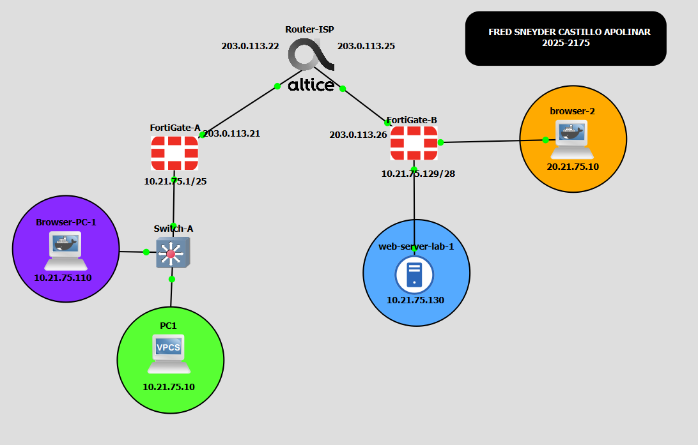
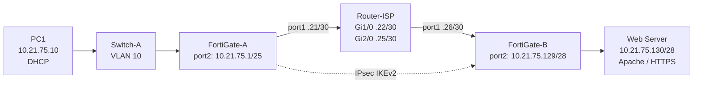
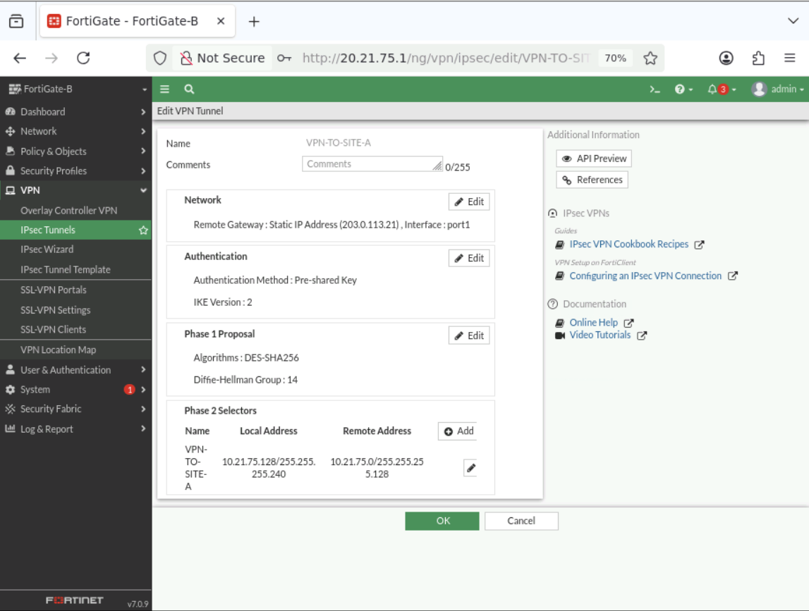
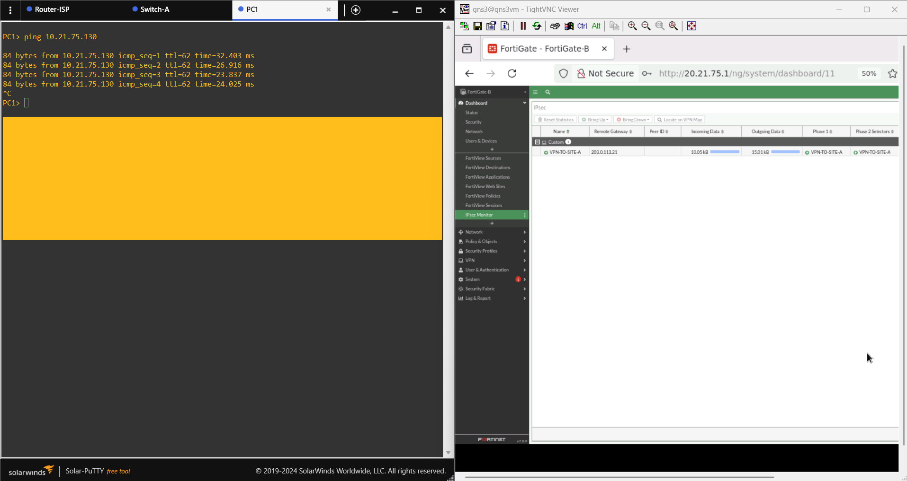
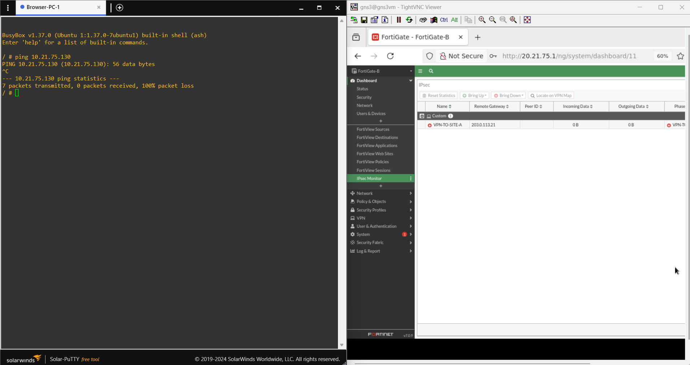
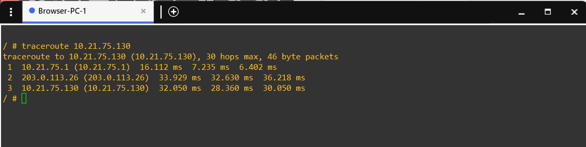

<h1 align="center">🔐 VPN Site-to-Site IPsec FortiGate</h1>

<p align="center">
  <a href="https://github.com/fredcastillo/fortigate-site-to-site-vpn"></a>
  <a href="https://github.com/fredcastillo/fortigate-site-to-site-vpn"></a>
  <a href="https://github.com/fredcastillo/fortigate-site-to-site-vpn"></a>
  <a href="https://github.com/fredcastillo/fortigate-site-to-site-vpn"></a>
  <a href="https://github.com/fredcastillo/fortigate-site-to-site-vpn"></a>
  <a href="https://github.com/fredcastillo/fortigate-site-to-site-vpn"></a>
</p>

> **Seguridad de Redes · GNS3 · FortiOS v7.0.9**

## 🎥 Video demostrativo

**Video:** [▶ Ver demostración en YouTube]((https://www.youtube.com/watch?v=bi5LRA3CluY))

**Estudiante:** Fred Sneyder Castillo Apolinar  
**Matrícula:** 2025-2175  
**Infraestructura:** 1  
**Asignatura:** Seguridad de Redes  
**Entorno:** GNS3  
**FortiOS:** v7.0.9  
**VPN:** IPsec Site-to-Site

---

## 📌 Propósito del laboratorio

El laboratorio implementa una comunicación segura entre dos redes privadas ubicadas en sitios diferentes mediante una VPN **IPsec Site-to-Site** entre dos firewalls FortiGate.

La infraestructura representa:

- **Sitio A:** red de usuarios `10.21.75.0/25`.
- **Sitio B:** red del servidor `10.21.75.128/28`.
- **Tránsito WAN:** dos enlaces `/30` simulados mediante un Router-ISP.
- **Servicio remoto:** servidor web HTTPS ubicado en el Sitio B.

El objetivo funcional de la práctica es que el usuario del Sitio A pueda comunicarse con el servidor del Sitio B **a través del enlace VPN**, y demostrar que dicha comunicación deja de funcionar cuando el túnel no está activo.

---

## Objetivos

### Objetivo principal

Establecer y validar un túnel IPsec Site-to-Site entre FortiGate-A y FortiGate-B para transportar el tráfico entre la red de usuarios y la red del servidor sin realizar NAT sobre el tráfico VPN.

### Objetivos específicos

- Configurar el direccionamiento de los FortiGate.
- Configurar conectividad WAN mediante el Router-ISP.
- Configurar VLAN 10 para la red de usuarios.
- Habilitar DHCP para la LAN del Sitio A.
- Configurar NAT para la salida a Internet.
- Configurar el servidor web HTTPS del Sitio B.
- Crear el túnel IPsec en modo **Custom**.
- Configurar los selectores de tráfico de Phase 2.
- Configurar rutas estáticas hacia la LAN remota.
- Crear políticas bidireccionales LAN ↔ VPN.
- Verificar conectividad Usuario → Web Server.
- Realizar traceroute hacia el servidor.
- Demostrar la dependencia de la comunicación respecto al estado de la VPN.

---

## 🗺️ Topología



La topología real se implementó en GNS3. Los **Browser-PC** aparecen como equipos auxiliares para administración de las interfaces GUI de los FortiGate; no constituyen el flujo funcional principal de la infraestructura.



> **Diagrama:** la captura real de GNS3 se conserva como evidencia; el diagrama Mermaid complementa la lectura técnica del repositorio.

---

## 🌐 Direccionamiento

| Dispositivo | Interfaz | Dirección | Función |
|---|---|---:|---|
| FortiGate-A | `port1` | `203.0.113.21/30` | WAN / tránsito ISP |
| Router-ISP | `GigabitEthernet1/0` | `203.0.113.22/30` | Tránsito hacia Sitio A |
| Router-ISP | `GigabitEthernet2/0` | `203.0.113.25/30` | Tránsito hacia Sitio B |
| FortiGate-B | `port1` | `203.0.113.26/30` | WAN / tránsito ISP |
| FortiGate-A | `port2` | `10.21.75.1/25` | Gateway LAN usuarios |
| PC1 | LAN | `10.21.75.10` | Usuario / DHCP |
| FortiGate-B | `port2` | `10.21.75.129/28` | Gateway LAN servidor |
| Web Server | LAN | `10.21.75.130/28` | Servidor HTTPS |

### Redes

- **LAN Usuarios:** `10.21.75.0/25` (`255.255.255.128`)
- **LAN Servidor:** `10.21.75.128/28` (`255.255.255.240`)
- **WAN A:** `203.0.113.20/30`
- **WAN B:** `203.0.113.24/30`

---

## 🔐 Diseño de la VPN IPsec

### FortiGate-A → Sitio B

| Parámetro | Valor |
|---|---|
| Nombre | `VPN-TO-SITE-B` |
| Modo | Custom |
| Interfaz | `port1` |
| Remote Gateway | `203.0.113.26` |
| IKE | v2 |
| Autenticación | Pre-Shared Key |
| Proposal Phase 1 | `DES-SHA256` |
| DH Group | `14` |
| Local Selector | `10.21.75.0/25` |
| Remote Selector | `10.21.75.128/28` |
| Proposal Phase 2 | `DES-SHA256` |

### FortiGate-B → Sitio A

| Parámetro | Valor |
|---|---|
| Nombre | `VPN-TO-SITE-A` |
| Modo | Custom |
| Interfaz | `port1` |
| Remote Gateway | `203.0.113.21` |
| IKE | v2 |
| Autenticación | Pre-Shared Key |
| Proposal Phase 1 | `DES-SHA256` |
| DH Group | `14` |
| Local Selector | `10.21.75.128/28` |
| Remote Selector | `10.21.75.0/25` |
| Proposal Phase 2 | `DES-SHA256` |




---

## 🛣️ Enrutamiento

### FortiGate-A

- Ruta por defecto: `0.0.0.0/0` → gateway `203.0.113.22` por `port1`.
- Ruta remota: `10.21.75.128/28` por `VPN-TO-SITE-B`.

### FortiGate-B

- Ruta por defecto: `0.0.0.0/0` → gateway `203.0.113.25` por `port1`.
- Ruta remota: `10.21.75.0/25` por `VPN-TO-SITE-A`.

El Router-ISP no necesita rutas estáticas adicionales para estas dos redes WAN porque ambas son directamente conectadas al router.

---

## 🛡️ Políticas de Firewall y NAT

### FortiGate-A

| Política | Entrada | Salida | Origen | Destino | NAT |
|---|---|---|---|---|---|
| `LAN -> VPN` | `port2` | `VPN-TO-SITE-B` | `LAN_USUARIOS` | `LAN_SERVIDOR` | Deshabilitado |
| `VPN -> LAN` | `VPN-TO-SITE-B` | `port2` | `LAN_SERVIDOR` | `LAN_USUARIOS` | Deshabilitado |
| `USUARIOS_A_INTERNET` | `port2` | `port1` | `LAN_USUARIOS` | `all` | Habilitado |

### FortiGate-B

| Política | Entrada | Salida | Origen | Destino | NAT |
|---|---|---|---|---|---|
| `LAN -> VPN` | `port2` | `VPN-TO-SITE-A` | `LAN_SERVIDOR` | `LAN_USUARIOS` | Deshabilitado |
| `VPN -> LAN` | `VPN-TO-SITE-A` | `port2` | `LAN_USUARIOS` | `LAN_SERVIDOR` | Deshabilitado |
| `WEBSERVER_A_INTERNET` | `port2` | `port1` | `LAN_SERVIDOR` | `all` | Habilitado |

El NAT permanece deshabilitado específicamente en el tráfico que atraviesa la VPN, de forma que las direcciones privadas de las dos LAN permanezcan intactas durante la comunicación Site-to-Site.


---

## 🖧 VLAN 10 y DHCP

La red de usuarios utiliza **VLAN 10**.

En el Switch-A, los puertos `GigabitEthernet0/0`, `GigabitEthernet0/1` y `GigabitEthernet0/2` aparecen configurados como `access` en VLAN 10.

El DHCP se habilitó en `port2` del FortiGate-A:

- Red: `10.21.75.0/25`
- Gateway: `10.21.75.1`
- Rango: `10.21.75.10 – 10.21.75.100`
- DNS: servicio predeterminado de FortiOS

PC1 utiliza DHCP y fue identificado durante el laboratorio con la dirección `10.21.75.10`.


---

## 🌐 Web Server

El Sitio B contiene el recurso que se protege con la VPN.

| Parámetro | Valor |
|---|---|
| Sistema operativo | Debian |
| IP | `10.21.75.130/28` |
| Servicio | Apache |
| Acceso | HTTPS |

El servidor web se encuentra detrás de `FortiGate-B` y funciona como destino de las pruebas de comunicación iniciadas desde el Sitio A.


---

## ✅ Validación del objetivo de seguridad

La validación se organiza alrededor de tres estados:

### 1. VPN activa

El túnel IPsec se encuentra operativo y el usuario del Sitio A puede comunicarse con el Web Server del Sitio B.



### 2. VPN no activa

Se interrumpe el enlace VPN y se repite la prueba de comunicación. La finalidad es demostrar que el acceso entre las redes privadas depende del túnel.



### 3. Traceroute

Se ejecuta traceroute desde la red de usuarios hacia el servidor para demostrar el camino seguido por el tráfico hacia la red remota.



---

## 📸 Evidencias

| Archivo | Evidencia |
|---|---|
| `01-topology-gns3.png` | Topología real en GNS3 |
| `02-vpn-fortigate-a.png` | Configuración/estado VPN en FortiGate-A |
| `03-vpn-fortigate-b.png` | Configuración/estado VPN en FortiGate-B |
| `04-policies-fortigate-a.png` | Policies de FortiGate-A |
| `05-policies-fortigate-b.png` | Policies de FortiGate-B |
| `06-vlan-dhcp.png` | VLAN 10 / DHCP |
| `07-webserver-https.png` | Servicio HTTPS |
| `08-connectivity-vpn-up.png` | Comunicación con VPN activa |
| `09-connectivity-vpn-down.png` | Comunicación con VPN inactiva |
| `10-traceroute.png` | Traceroute |

---

## 📂 Running-Configs

Los archivos de configuración disponibles se encuentran en `configs/`:

- [FortiGate-A — secciones relevantes del running-config](configs/FortiGate-A/running-config-relevant-sections.txt)
- [FortiGate-B — secciones relevantes del running-config](configs/FortiGate-B/running-config-relevant-sections.txt)
- [Router-ISP — running-config](configs/Router-ISP/running-config.txt)
- [Switch-A — running-config](configs/Switch-A/running-config.txt)

---

## 📜 Scripts y comandos

La configuración funcional de los FortiGate correspondiente a la VPN, routing y políticas fue realizada mediante la **GUI**, de acuerdo con el requisito de la práctica.

La CLI se utilizó únicamente para la inicialización necesaria de interfaces/acceso y para consultas/verificaciones posteriores. El repositorio contiene los comandos de consulta que fueron realmente ejecutados y evita inventar un script de despliegue que no fue utilizado.

- [Scripts y notas](scripts/README.md)
- [Comandos de verificación](scripts/verification-commands.txt)

---

## 📁 Estructura del repositorio

```text
FortiGate-Site-to-Site-VPN/
├── README.md
├── docs/
│   ├── 01-architecture.md
│   ├── 02-addressing.md
│   ├── 03-fortigate-a.md
│   ├── 04-fortigate-b.md
│   ├── 05-vlan-dhcp.md
│   ├── 06-web-server.md
│   └── 07-validation.md
├── images/
│   ├── 01-topology-gns3.png
│   ├── 02-vpn-fortigate-a.png
│   └── [futuras evidencias]
├── configs/
│   ├── FortiGate-A/
│   ├── FortiGate-B/
│   ├── Router-ISP/
│   └── Switch-A/
├── scripts/
├── video/
└── internal/
```

---

## 👤 Autor

**Fred Sneyder Castillo Apolinar**  
Matrícula: **2025-2175**
