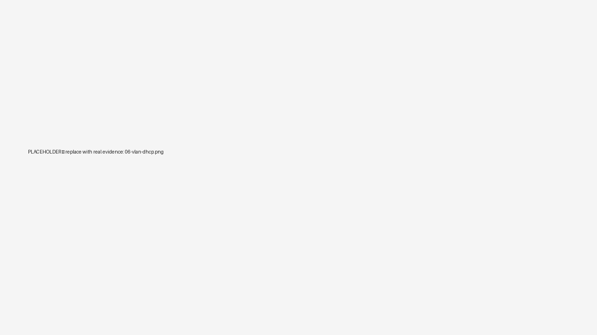

# 05 — VLAN 10 y DHCP

## VLAN 10

El Switch-A utiliza VLAN 10 para la red de usuarios.

El running-config compartido confirma los siguientes puertos como acceso en VLAN 10:

```text
GigabitEthernet0/0
GigabitEthernet0/1
GigabitEthernet0/2
```

Configuración observada:

```text
switchport access vlan 10
switchport mode access
```

## DHCP del Sitio A

El DHCP se habilita en `port2` de FortiGate-A:

```text
Network:   10.21.75.0/25
Gateway:   10.21.75.1
Range:     10.21.75.10 - 10.21.75.100
```

PC1 se identifica como `10.21.75.10` durante el laboratorio.


